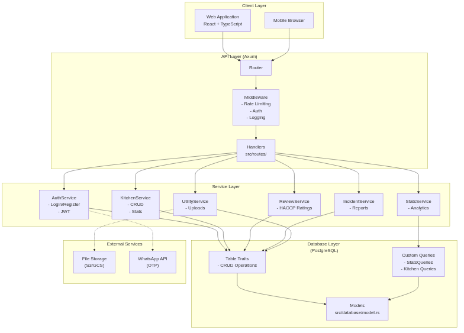
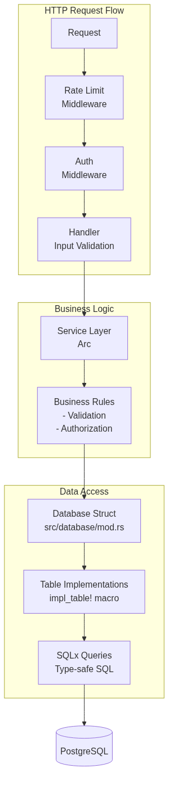
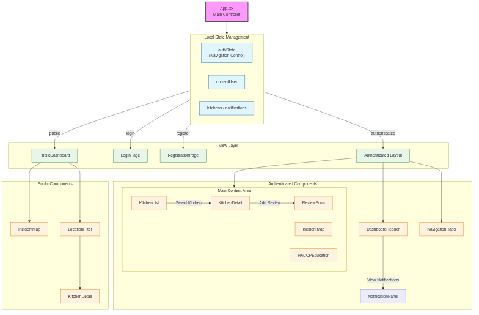
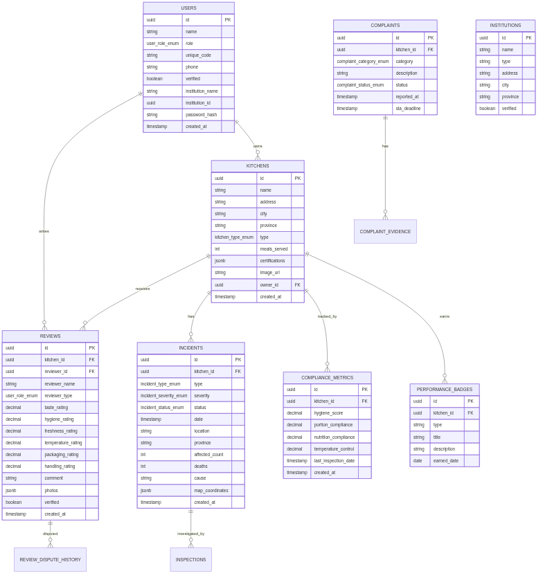
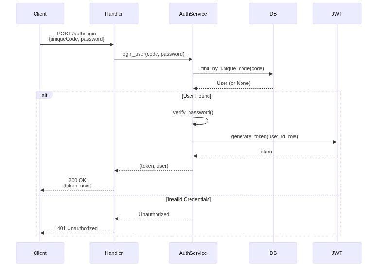
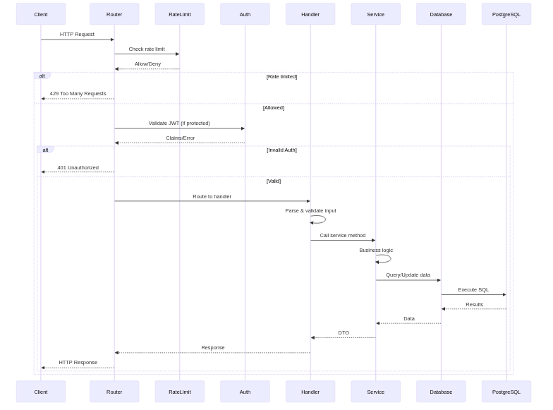
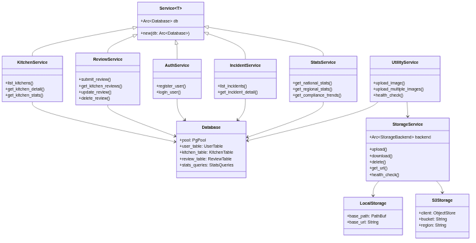
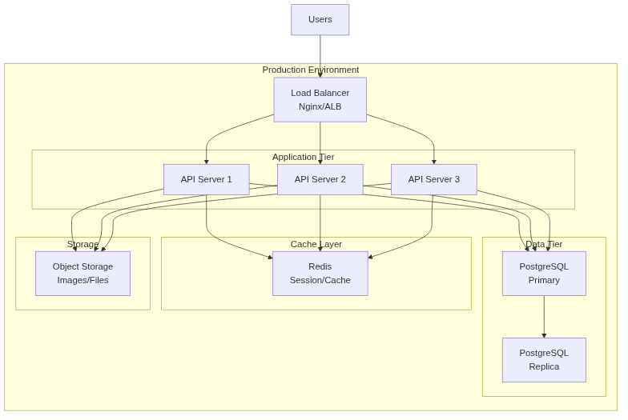

# MonitorMBG High-Level Architecture

## System Overview

## Backend Architecture

## Frontend Architecture

## Database Schema Overview

## Authentication Flow

## UI Flow

## Request Lifecycle

## Service Layer Pattern

## Deployment Architecture

